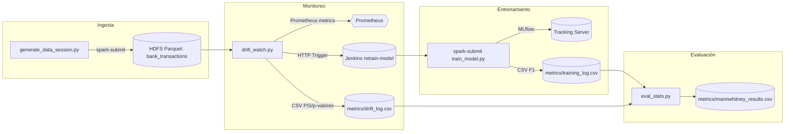

# Arquitectura de Arlequin

Notas
- El watcher compara ventanas móviles por `ingest_ts` (por defecto 5 minutos) y dispara Jenkins si detecta drift por KS/Chi² o PSI.
- El pipeline de Jenkins ejecuta el entrenamiento y luego la evaluación estadística, dejando artefactos CSV en `metrics/`.

